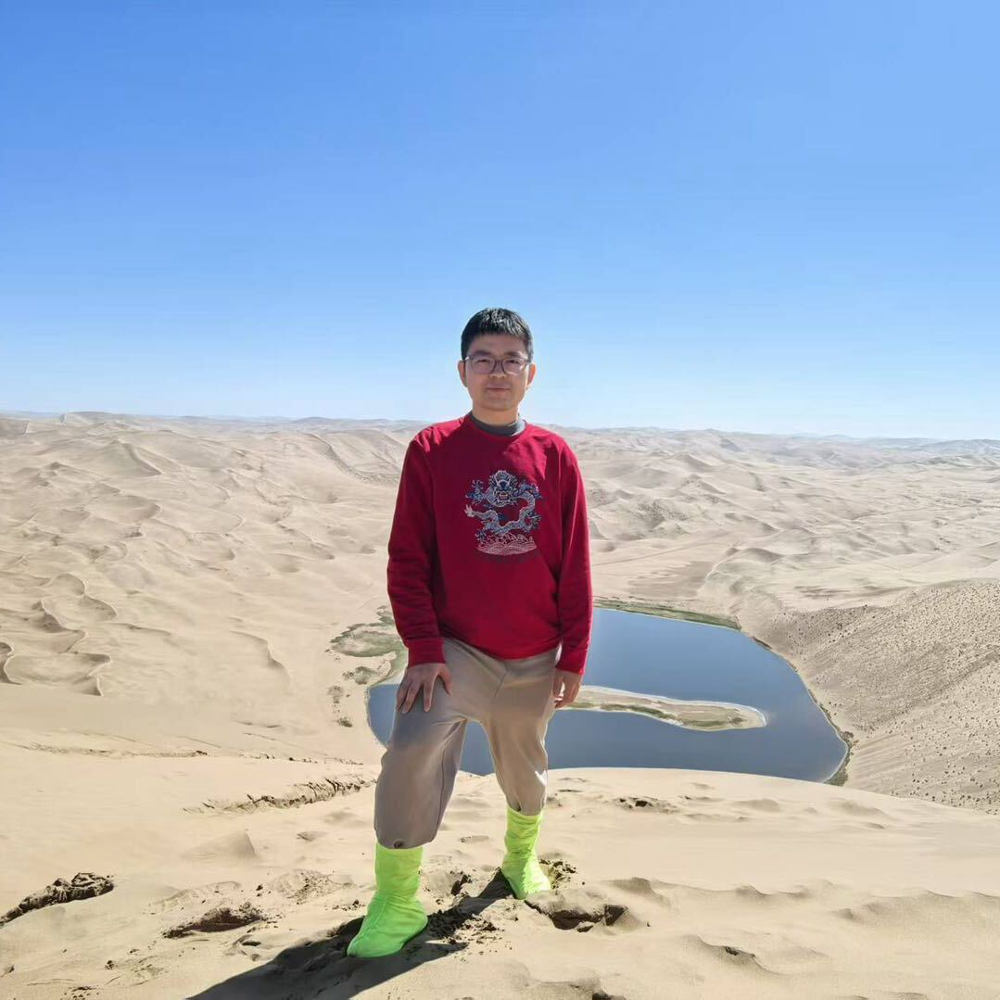

# Hi there, I'm Zhengyao Huang 👋

## About Me
I am a first-year PhD student in Mathematics at **Durham University**. I am working under the supervision of Wilhelm Klingenberg and Fernando Galaz-García.

My research interests lie in the **Calculus of Variations** and **Geometric Measure Theory**. Specifically, I am currently working on the **Optimal Transport** problem.

## Get in Touch
You can reach me via email at:
📧 [phqv76@durham.ac.uk](mailto:phqv76@durham.ac.uk)
